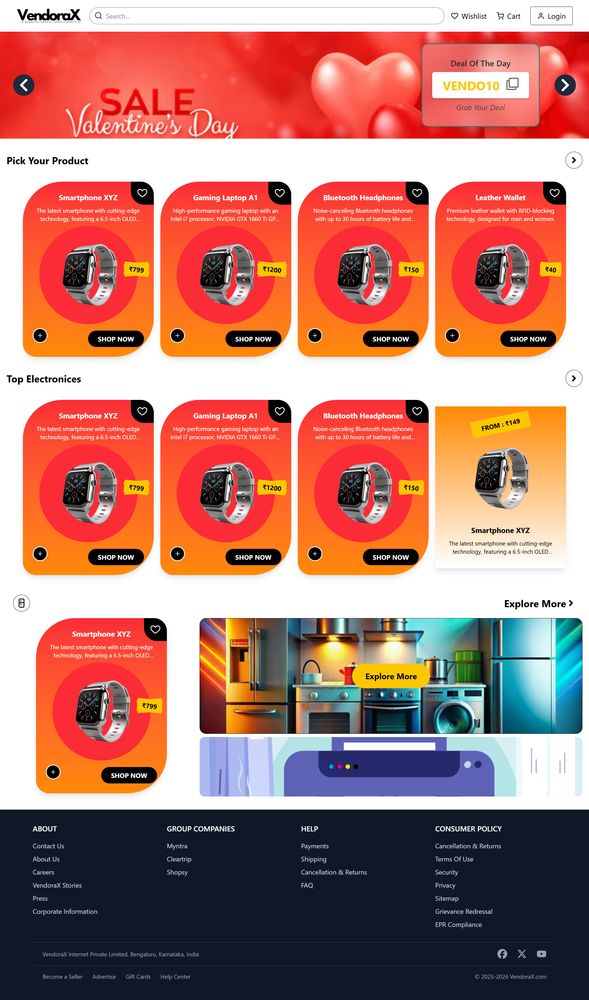

# VendoraX – A Powerful Vendor-Centric Platform  

## 🚀 Demo Link  
[Click Here to Visit VendoraX](#)  

---

## 📌 About  
VendoraX is a vendor-centric platform designed to streamline product management, authentication, and seamless shopping experiences.  

---

## 🎯 Features  
- 🛒 **Product Management** – Add, update, and view products with ease.  
- 🔐 **Authentication System** – Secure user login and registration.  
- 💖 **Wishlist & Cart** – Save favorite products and manage your shopping cart.  
- 🌐 **Responsive Design** – Works seamlessly on all devices.  
- 🌟 **Intuitive UI** – Clean and user-friendly design.  
- ⚡ **Optimized Performance** – Fast and lightweight with Vite.  

---

## 🗂️ **UI Design**  

### 🏠 Home Page  


### 🔍 Seller Welcome  
  

### 🛒 Cart Page  
  

### 🔑 Authentication Page  
  

---

## 🛠️ ** Folder Structure**  
```
B42_WEB_063_The-Code-Smiths/
Clients/
│── node_modules/
│── public/
│── src/
│   ├── assets/
│   ├── Components/
│   ├── Data/
│   ├── Pages/
│   │   ├── Authentication/
│   │   ├── Products/
│   │   ├── Section/
│   ├── UI/
│   │   ├── Pallete/
│   ├── Banner.jsx
│   ├── ProductDetails.jsx
│   ├── App.css
│   ├── App.jsx
│   ├── index.css
│   ├── main.jsx
│── .gitignore
│── eslint.config.js
│── index.html
│── package-lock.json
│── package.json
│── README.md
│── vite.config.js
Server/
│── API/
│   ├── Controllers/
│   ├── Middleware/
│   ├── Models/
│   ├── Routes/
│── config/
│── node_modules/
│── .env
│── package-lock.json
│── package.json
│── Server.js
│── .gitignore
```
---

## 📚 **Installation Guide**  

### 🚀 **Frontend Setup**  
```bash
# Clone the repository
git clone https://github.com/rohitKumarSingh19/B42_WEB_063_The-Code-Smiths

# Navigate to the frontend directory
cd Client

# Install dependencies
npm install

# Start the development server
npm run dev
```

### ⚙️ **Backend Setup**  
```bash
# Navigate to the backend directory
cd Server

# Install dependencies
npm install

# Start the server
npm start
```
---

## 🛠️ **Tech Stack**  
### Frontend  
- 🌐 **React.js**
- ⚡ **Vite**
- 🎨 **Tailwind CSS**
- 🔄 **React Router DOM**
- 🍜 **React Toastify**  

### Backend  
- ⚙️ **Node.js**
- 🔥 **Express.js**
- 💢 **MongoDB**
- 🔒 **JWT Authentication**
- 🛠 **Mongoose**  


---

## 📩 **Contact**  
For any inquiries, contact us at [utkarshraj525@gmail.com](mailto:utkarshraj525@gmail.com)  

---

**© 2025 VendoraX – All Rights Reserved.** 🚀🔥  

